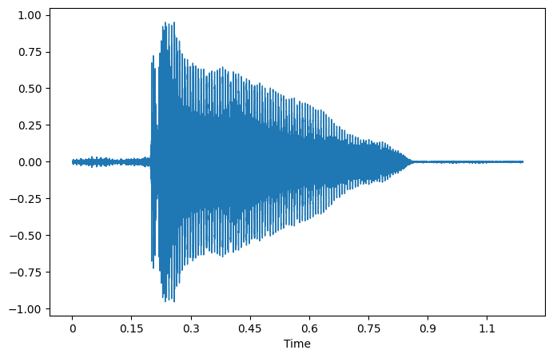

Audio
####################

Concept
**********

SampleRate, sr
====================

一般是 16k

Basic
**********

.. note:: 在jupyter笔记本中播放音频

    .. code-block:: py
        
        !IPython.display.Audio

互转
==========

opus|aac
--------------------

.. code-block:: py
    :caption: opus|aac -> wav

    import moviepy.editor as mp
    my_clip = mp.AudioFileClip(r"input_path.opus")
    my_clip.write_audiofile(r"input_path.mp3")

`opus转mp3 python音频转换 (aac文件同样可行) <https://blog.csdn.net/monopoc/article/details/130643213>`_

可视化
**********

.. code-block:: py
    :caption: 加载 音频文件

    import librosa
    import matplotlib.pyplot as plt

    audio_path = '../T08-violin.wav'
    x , sr = librosa.load(audio_path)

waveplot 波形图
====================

.. grid:: 2

    .. grid-item::

        .. code-block:: py

            plt.figure(figsize=(8, 5))
            librosa.display.waveshow(x, sr=sr)

    .. grid-item::

        波形

谱图
==========

谱图是通过视觉表示频谱的频率、声音或其他信号，因为它们随时间变化。频谱图有时被称为超声波仪，声纹或语音图。当数据在3D图中表示时，它们可以称为waterfalls。在二维阵列中，第一轴是频率，而第二轴是时间。

.. grid:: 2

    .. grid-item::

        .. code-block:: py

            X = librosa.stft(x)
            Xdb = librosa.amplitude_to_db(abs(X))
            plt.figure(figsize=(14, 5))
            librosa.display.specshow(Xdb, sr=sr, x_axis='time', y_axis='hz')
            plt.colorbar()

    .. grid-item::

        .. figure:: ./pics/audio_specshow1.png

            纵轴表示频率（从0到10kHz），横轴表示剪辑的时间。由于我们看到所有动作都发生在频谱的底部，我们可以将频率轴转换为对数轴。

    .. grid-item::

        .. code-block:: py

            plt.figure(figsize=(8, 5))
            librosa.display.specshow(Xdb, sr=sr, x_axis='time', y_axis='log')
            plt.colorbar()

    .. grid-item::

        .. figure:: ./pics/audio_specshow2.png

    
        
特征提取
********************

过零率
==========

**语音识别** , **音乐信息检索**

.. hint:: 对于像金属和岩石那样的高冲击声，它通常具有更高的值。

.. code-block:: py

    zero_crossings = librosa.zero_crossings(x, pad=False)
    print(sum(zero_crossings))
    # 1296

光谱质心
====================

它指示声音的“质心”位于何处，并计算为声音中存在的频率的加权平均值。

.. hint:: 如果有两首歌曲，一首来自布鲁斯类型，另一首属于金属。与长度相同的布鲁斯流派歌曲相比，金属歌曲在最后有更多的频率。因此，布鲁斯歌曲的光谱质心将位于其光谱中间附近，而金属歌曲的光谱质心将朝向它的末端。

`手把手教你语音识别 <https://mp.weixin.qq.com/s?__biz=MzUxNjM4MDg1NQ==&mid=2247483775&idx=1&sn=51ec1099fd041f3654ad7ffd9a489bf8&chksm=f9a900a7cede89b15ff6254f418b9802bb15c6530d92b6d9cc70480ca3a5017d8d51ec1d3846&scene=21#wechat_redirect>`_

`了解機器學習的音訊訊號 <https://www.youtube.com/watch?v=daB9naGBVv4>`_  这是一个系列

`手把手教你语音识别（二） <https://blog.csdn.net/qq_23953717/article/details/126030690>`_
`手把手教你语音识别（三） <https://blog.csdn.net/qq_23953717/article/details/126103648?spm=1001.2014.3001.5502>`_

`Music Genre Classification with Python <https://farranaanjum05.medium.com/music-genre-classification-with-python-51bff77adfd6>`_

`Music genre classification notebook <https://gist.github.com/parulnith/7f8c174e6ac099e86f0495d3d9a4c01e#file-music_genre_classification-ipynb>`_

Import!!! `Python处理音频信号实战 : 手把手教你实现音乐流派分类和特征提取 <https://www.jiqizhixin.com/articles/2019-01-11-25>`_

`[开发技巧]·Python实现信号滤波（基于scipy） <https://www.cnblogs.com/xiaosongshine/p/10831931.html>`_
