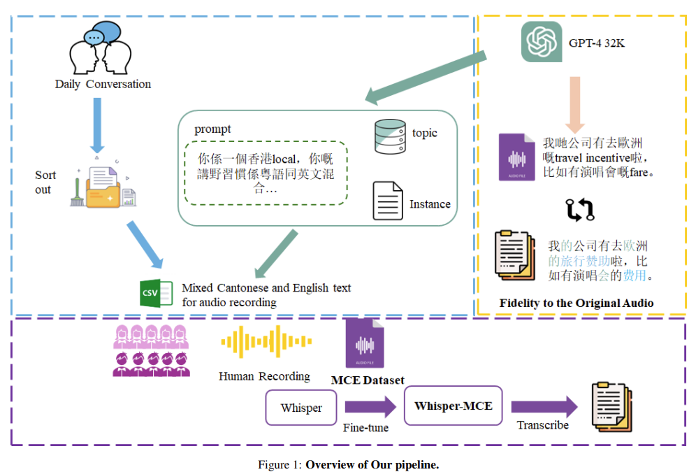

TODO
####################

Model
********************

- 对于双向的 bi-direction & 一些Seq2Seq 来说，比起单纯一个epoch纯单向 zh_2_en 或者 en_2_zh, 在一个epoch里 打乱 随机选取一个方向去train 表现会更好

- Cantonese-filter 可以区分纯粤语文 & 官话文本 & 中立
    但是 strict rules

Whisper_MCE
********************

``2024.2.18``

`【PAPER】MCE: Mixed Cantonese and English Audio Dataset <https://arxiv.org/pdf/2310.17953v2>`_

NEW
==========

- 34.8-hour ==MCE audio dataset==
- ==fine-tuned Whisper== 
- ==FAL==

MCE audio dataset
--------------------

- generated using GPT-4
- mixed-language ASR in Cantonese and English

    In the initial stage (Blue), we collect and sort texts in Cantonese and English from high-quality daily conversations, and we also use GPT-4 to generate additional texts in Cantonese and English. Moving on to the second stage (Purple), we hire individuals to create an audio dataset called MCE based on the generated text. Next, we use our dataset to fine-tune Whisper. Finally, in the third stage (Orange), we use GPT-4 to evaluate the performance of our fine-tuned model Whisper-MCE.

FAL(↑)
----------

.. note:: drawbacks of CER

    it may not capture the specific challenges or differences between different writing systems. Particularly for cases **involving languages with different scripts
like Simplified Chinese and Traditional Chinese**, solely using CER may not provide a comprehensive evaluation
    

MER and CER pose challenges when it comes to evaluating its effectiveness in mixed-language and minor
language contexts.

FAL, which utilizes GPT-4, taking into consideration three pivotal metrics: Fidelity to the Original Audio, Accuracy, and Latency. 

both pure
Cantonese ASR and mixed Cantonese and English ASR
tasks

Model： Whisper_MCE
********************

- Dataset: self-collected MCE audio dataset
- Evaluation: Mix Error Rate
    - 12.61% CER Common voice zh-HK

- fine-tune the Whisper model across both **pure Cantonese** ASR and **mixed Cantonese and English** ASR tasks.