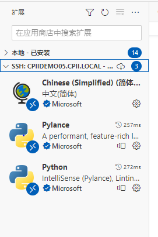

Vscode
##########

Remote Development [extention]
**************************************************

远程修改与调试服务器上的代码，同时具备代码高亮与补全功能，就和在本地使用VScode一样

1. 远程主机安装ssh-server(雨女无瓜)
2. 本地主机安装ssh-client
    
    - check 有没有 cmd  ``ssh`` 

3. vscode 安装Remote Development 插件

    - extensions 里 download
    - 连接主机  ``ctrl+shift+p``  search  ``Remote-SSH connect to Host`` 

        -  ``ssh <用户名>@<hostname>`` 
            在 SSH 连接时，格式通常为 ssh <用户名>@<hostname>，其中 <用户名> 表示你在远程主机上登录时使用的用户名，<hostname> 表示远程主机的名称或 IP 地址
    - 修改设定  ``ctrl+shift+p``  search  ``Remote-SSH Open SSH Setting``

        - ✔   ``Show Login Terminal``  显示登录控制台选项。
        - ❌  ``Use Local Server`` ，不使用本地服务器，因为远程开发，而非本地开发，如果不取消远程开发配置无法正常工作。
    
    - 免密连接 _WIN10_
    
        - 修改 **自己** 设定，告诉它 private key 的位置  ``ctrl+shift+p``  search  ``Remote-SSH Open SSH configuration File`` , 参照ssh连接主机的命令  ``ssh <用户名>@<hostname>`` 

        .. code-block:: none

            Host <别名, 你为远程主机指定的唯一别名> 
                HostName <hostname：IP 地址或域名>
                User <用户名，在工作站上的用户名>
                Port <端口号： 一般是22 openSSL> 
                IdentityFile <私钥文件路径，自己在终端先配置密钥>
            
            # e.g.
            Host company
                HostName company.local
                Port 22
                IdentityFile C:\user\.ssh\id_rsa

        - 修改 **远程主机**， 把自己的 public key 发给它，在远程机器用公钥生成authorized_keys
        
            - 修改  ``/home/user/.ssh/authorized_keys`` , 如果没有就创建
            - 创建  ``mkdir "~/.ssh" && touch ~/.ssh/authorized_keys`` 
            - 修改  ``vim authorized_keys`` 
            - 打开自己的 public key (一般是  ``C:\user\.ssh\id_rsa.pub`` )复制粘贴进去。
            
                - 虽然很长，但公钥文件的所有内容只有一行
                - 人们可以将任意数量的公钥添加到 autorized_keys 文件中。因此该文件包含多行，每个公钥一行。这使得多台机器在工作站上注册。
        - 如果询问密码，那就是没配置好，重新检查一下

- Reference
    - `VScode Remote 远程开发与调试 <https://www.jianshu.com/p/0f2fb935a9a1>`_
    - `VScode连接服务器 <https://blog.csdn.net/weixin_43466026/article/details/121416372>`_
    - `Using Conda Environment Remotely with Visual Studio Code <https://hackmd.io/@MingRuey/HJOJ30ajO>`_
    - `Remote Access to the Workstation <https://hackmd.io/9iVBJfITQwy8tIz9ubgorw?view#Q-How-can-I-avoid-typing-password-each-time>`_

配置
**********

- 插件配置

登陆上远程服务器后，插件栏就变成了本地和远程两个部分。登陆上后远程自己也会自动安装插件，最后可以手动比对一下， **如果哪个没有自动安装上就要自己再安装**。并且配置过程和本地debug配置过程是一样的

SSH 配置
**********

practical use
====================

- 在本地机器生成密钥对(公钥+私钥)： ``ssh-keygen`` 
    - 一般在  ``C:\user\.ssh``  里，隐藏文件夹
    -  ``id_rsa.pub`` 是公钥， ``id_rsa`` 是私钥
    - 如果已经存在会提醒是否 overwrite

Setting
**********

user snippets
====================

.. grid:: 2

    .. grid-item::
        :columns: 4
        
        .. figure:: ./pics/vscode_snippets.png
            :scale: 50%

            进入user snippets， 在不同的json上写，可在特定语言文件激活不同的。

        - ``$num`` (``$1``, ``$2``)
            | ``$`` 后面紧跟数字可指定代码片段触发落入编辑器之后的光标位置，光标位置按照从小到大排序。
            | 按 ``Tab`` 跳转
        - ``body`` 支持 ``\t\n``。
            但不建议用 ``\n`` 因为很难看出代码片段的结构，建议还是直接给单独一行来展示

    .. grid-item::
        :columns: 6

        .. code-block:: json
            :caption: example

            {

                "code-block":{  // name
                    "prefix": "..c", // 触发代码片段的字符
                    "body":[
                        ".. code-block:: $1", //触发的代码片段
                        "",
                        "\t$2",
                        "",
                        "$3"
                    ]
                },
            }
        
`VSCode 利用 Snippets 设置超实用的代码块 <https://juejin.cn/post/6844903869424599053>_`

        
        
appereance
====================

垂直标尺
--------------------

.. grid:: 2

    .. grid-item::
        :columns: 8

        .. figure:: ./pics/vscode_rulers.png
        
            效果如图

    .. grid-item::
        :columns: 4
        
        `vscode显示120字符或者80字符提示线或者显示垂直标尺 <https://blog.csdn.net/weixin_42244181/article/details/135632055?utm_medium=distribute.pc_relevant.none-task-blog-2~default~baidujs_baidulandingword~default-5-135632055-blog-135571838.235^v43^pc_blog_bottom_relevance_base5&spm=1001.2101.3001.4242.4&utm_relevant_index=8>`_

